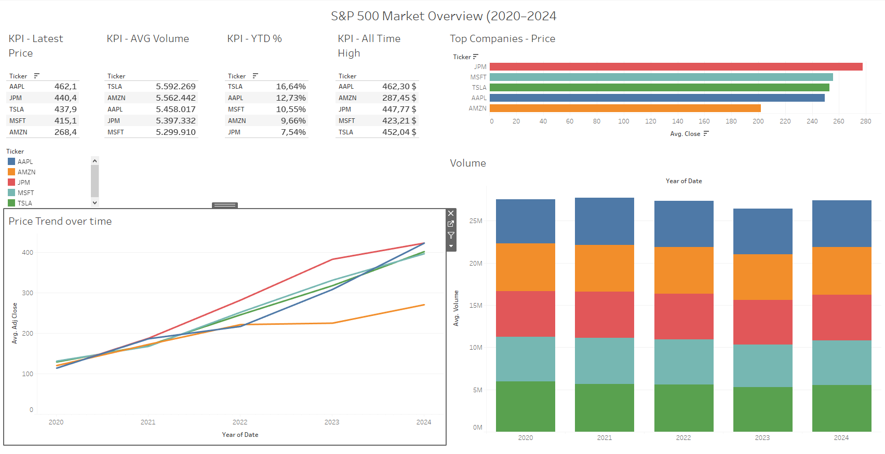

# 📊 S&P 500 Financial Market Dashboard (2020–2024)

An interactive Tableau dashboard analyzing stock price trends, trading volumes, and key performance metrics of major S&P 500 companies from 2020 to 2024.

---

## 🚀 Project Overview

This project visualizes historical market data for five major S&P 500 companies (Apple, Microsoft, Amazon, Tesla, JPMorgan Chase). It highlights trends in stock performance, trading activity, and financial indicators through an intuitive and interactive dashboard built in Tableau Public.

---

## 🎯 Key Features

- 📈 **Stock Price Trends** – Interactive line chart with date and ticker filters  
- 📊 **Volume Traded** – Bar chart showing trading activity over time  
- 🏆 **Top Companies** – Sorted performance table by closing price  
- 🔢 **KPI Tiles** – At-a-glance view of:
  - Latest Closing Price
  - Average Trading Volume
  - YTD Return (%)
  - All-Time High

---

## 📁 Project Structure

📦 financial-market-dashboard/
├── 📊 dashboard.twbx                  # Tableau Packaged Workbook
├── 📁 data/
│   └── sp500_stock_data.csv          # Historical stock data (2020–2024)
├── 📁 images/
│   └── dashboard_preview.png         # Screenshot of the dashboard
├── 📄 README.md   
---

## 📈 Tools Used

- **Tableau Public** – Data visualization
- **Python (yfinance)** – Data extraction and simulation
- **Pandas** – Data preprocessing
- **GitHub** – Version control and portfolio hosting

---

## 🧠 Insights & Observations

- Tesla showed the highest trading volume variability across the years.
- Apple and Microsoft demonstrated strong YTD growth in 2024.
- JPMorgan had stable long-term performance with less volatility.

---

## 📌 How to Use

1. Clone or download the repo
2. Open `dashboard.twbx` using Tableau Public (free)
3. Explore visuals and filter by company or date range

---

## 📄 License

MIT License 

